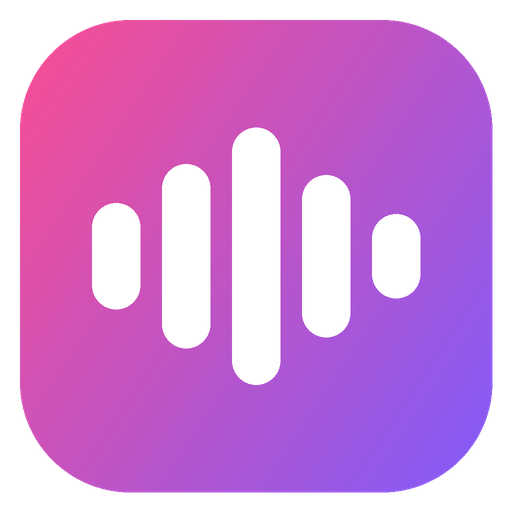
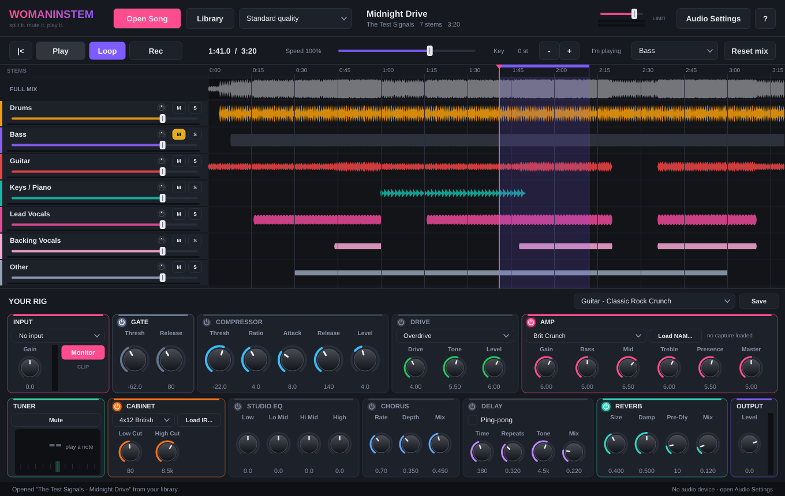
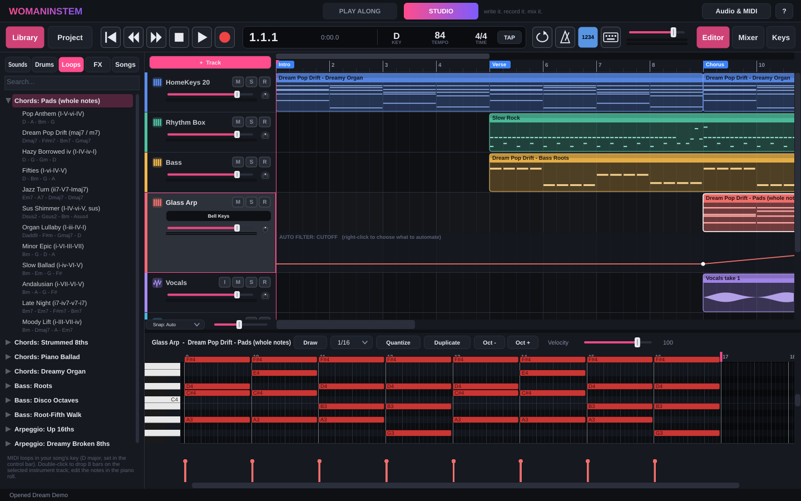
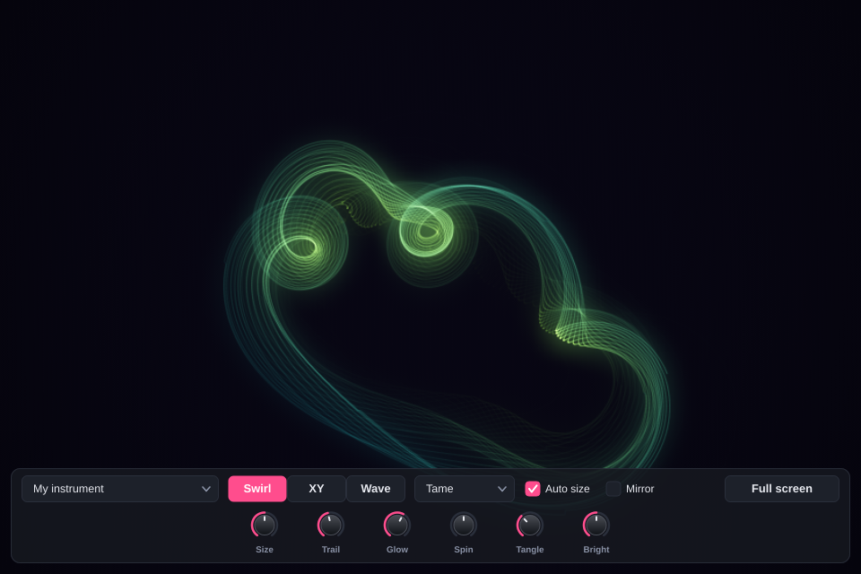
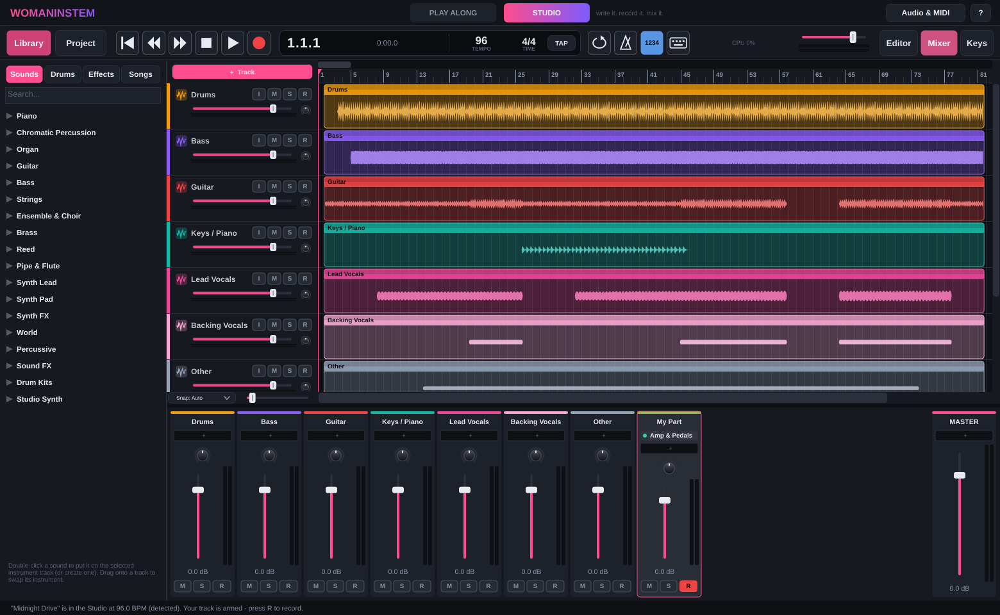
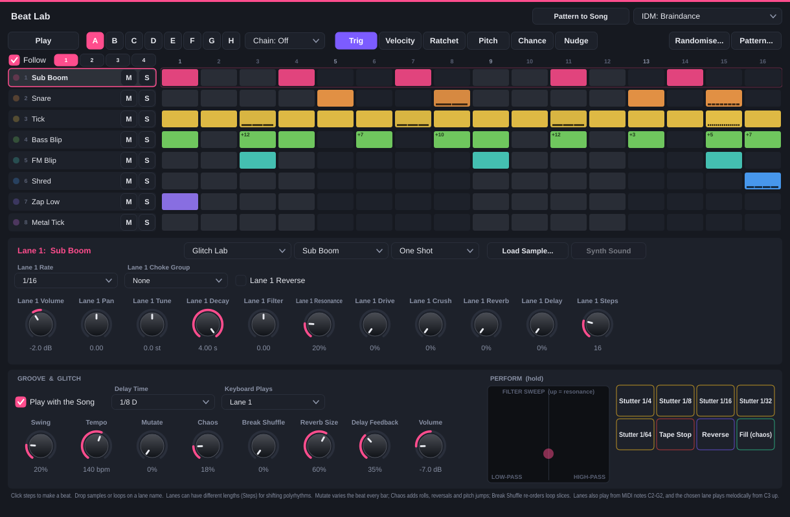
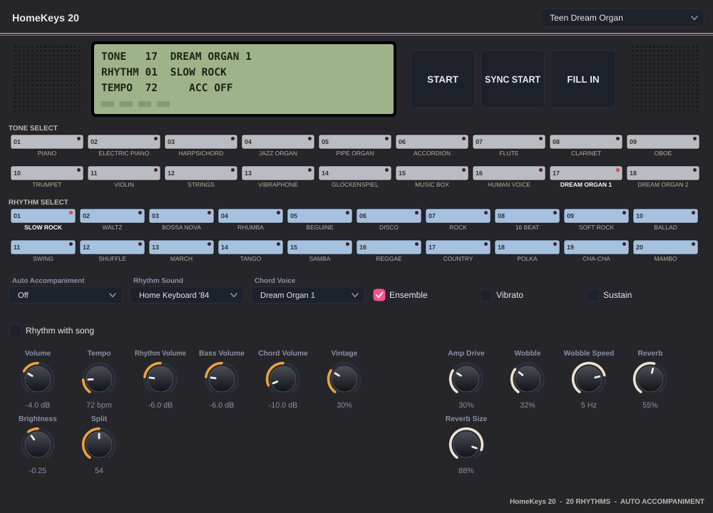

<p align="center">
  
</p>

<h1 align="center">WOMANINSTEM</h1>
<p align="center"><b>split it. mute it. play it. record it.</b></p>

<p align="center">
  Drop in any MP3 or FLAC → AI splits it into stems → mute your part → plug in your bass, guitar or mic and play along through a real amp rig.<br>
  Then take it into the <b>Studio</b>: a full multitrack recording studio with software instruments, the <b>Beat Lab</b> groovebox, an 80s home keyboard with a rhythm box, samplers, arpeggiators, a looper, vocal pitch correction, buses and sends, time-stretching, and VST3 / VST / CLAP / LV2 plugins.
</p>

<p align="center">
  <a href="../../releases/latest"><b>⬇ Download for Windows</b></a> ·
  <a href="#quick-start">Quick start</a> ·
  <a href="#the-studio">The Studio</a> ·
  <a href="#building-from-source">Build from source</a>
</p>

The app has two modes, switched with the tabs at the top (or `Ctrl+1` / `Ctrl+2`):

| **PLAY ALONG** | **STUDIO** |
|---|---|
|  |  |
| Split a song, mute your part, jam through the amp rig. | Write, record, arrange and mix your own songs. |

## Play Along

**Stem separation**: Meta's Demucs v4 (`htdemucs_6s`) runs locally on your CPU. No upload, no account, no subscription.

| Stem | Notes |
|---|---|
| Drums | kit and percussion |
| Bass | bass guitar, synth bass |
| Guitar | electric and acoustic |
| Keys / Piano | piano and most keyboard parts |
| Lead Vocals | the centre-panned main vocal |
| Backing Vocals | wide / doubled / harmony vocals, split from the lead by stereo position |
| Other | everything else: strings, horns, synths, pads, FX |

Stems are cached in your **Library** (24-bit FLAC), so a song is only ever split once. You can export any song's stems as WAV for your DAW.

**Play-along rig**: plug into any USB audio interface (ASIO, WASAPI exclusive/shared) and play through:

- **Input** with channel picker, gain, clip warning and a **chromatic tuner** (down to low B on a 5-string)
- **Strings & Pickups**: one knob turns your bass or guitar into another one: flatwounds, a 60s hollow-body *violin bass*, foam mute, bright roundwounds, P-bass, single coils or humbuckers. No EQ fiddling.
- **Noise gate** (hysteresis + hold, no chatter) and **compressor**
- **Drive pedal**: overdrive / distortion / fuzz, plus a **bass drive** that keeps your clean low end, oversampled
- **Amp**: 12 built-in models, each with its own preamp, real (modelled) tone-stack circuit, power amp, sag and bloom, 4× oversampled. Guitar: *American Clean, Tweed Breakup, British Chime, British Crunch, British Lead, Modern High Gain, Smooth Overdrive*. Bass: *60s British Valve, Classic Tube 8x10, Vintage Flip-Top, Modern Growl, Studio DI*. **Or load any [Neural Amp Modeler](https://www.neuralampmodeler.com/) `.nam` capture** (thousands free on [TONE3000](https://www.tone3000.com))
- **Cabinet**: 11 speaker cabinets (guitar 4x12s, 2x12s, 1x12s; bass 1x15, 2x15, 4x10 with horn, 8x10, 2x10) with a choice of **microphone** (dynamic, ribbon, condenser, dynamic + ribbon), **mic position** (centre to edge), **room**, and a phase-aligned **DI blend** like a studio bass recording. Or **any impulse response** (`.wav`)
- **Studio EQ, tape saturation, chorus, stereo/ping-pong delay, reverb** with pre-delay
- 22 factory presets, all loudness-matched, that sound finished with no extra EQ: for bass *60s Merseybeat (violin bass)*, *Late 60s Studio (DI + amp)*, *Motown Flatwound*, *Classic Rock 8x10*, *Modern Growl*, *Modern Clean Hi-Fi*, *Punk Pick*, *Dub Deep*, *Fuzz Bass*, *Clean DI*; for guitar clean, jangle, blues, crunch, high gain, lead, dream pop and fuzz. Save your own.

**Practice tools**: mute/solo/volume/balance per stem · one-click *"I'm playing: Bass"* · drag to loop a section (then drag its edges to fine-tune it) · slow down to 50% without pitch change · transpose ±12 semitones · record yourself as **Mix + Rig + dry DI** WAV files (re-amp the DI later) · safety limiter on the output.

## Scope

A glowing oscilloscope beam drawn by the sound, like the psychedelic projections behind Tame Impala. Click **Scope** at the top (or `Ctrl+Shift+O`), pick what it watches (your instrument, the song, everything, or **you vs the song** on the two axes; in the Studio the master or the selected track), drag the window onto a projector or second screen and press **F** for full screen.

<p align="center"></p>

- **Swirl**: a note draws a circle that grows the harder you play; chords and distortion turn it into flowers and knots. **XY**: classic Lissajous figures. **Wave**: the waveform, held still.
- Colours *Tame (lime + aqua)*, *Phosphor*, *Aqua*, *Hot pink*, *Amber*, *Rainbow*; size, trail, glow, spin, tangle and brightness; *Mirror* for a kaleidoscope; *Auto size* keeps it filling the screen.
- Full screen hides the controls and the pointer after a moment. Keys: `F` full screen, `Esc` back, `1` `2` `3` shapes, `C` colours, `M` mirror.

## The Studio

A GarageBand / Logic-style recording studio, built in. Everything runs at low latency on the same audio interface and the same amp rig.



### New in 3.2

- **Scope**: a projector-ready oscilloscope light show that reacts to your playing, a track or the whole mix (see [Scope](#scope)).

### New in 3.1

- **Beat Lab**: a groovebox for messing around with beats and loops (*+ Track → Beat Lab*). 8 lanes of drum-machine sounds, a *Glitch Lab* kit, **your own samples, or loops** that are chopped across the steps so they stay in time at any tempo. Per-step velocity, **ratchets / rolls** (up to 16, with rising, falling or fading shapes), **chance**, pitch, micro-timing and reverse. 8 patterns with chaining, per-lane length and rate (**polymeter**), per-lane filter, drive, bit-crush, reverb and delay. Hold-to-play **stutter, tape stop, reverse and fill**, an XY **filter sweep**, and an **IDM section**: *Mutate* (a new variation every bar), *Chaos* (rolls, reversals, pitch jumps) and *Break Shuffle* (re-orders loop slices). 14 presets from boom bap and house to drill'n'bass and braindance. *Pattern to Song* turns a pattern into a MIDI clip.
- **Amps 2.0**: 12 new amp models, 11 cabinets with mic choice / position / room / DI blend, *Strings & Pickups*, bass drive, tape saturation and 22 presets (see [Play Along](#play-along)).
- **Repeat (cycle) bar**: drag anywhere in the top strip of the ruler to draw it, drag its edges to resize it, drag the middle to move it, click to turn it on or off, double-click a bar to repeat just that bar, right-click for *Repeat 4 bars / selected clips / between markers / double / halve / move*.

<p align="center"></p>

### New in 3.0

- **Every plugin format**: VST3, VST (2.x), CLAP and LV2 instruments and effects, with their own interfaces, crash-safe scanning and **automatic delay compensation**.
- **Aux buses, sends and routing**: shared reverbs and delays (pre/post-fader sends), group buses, **side-chain** for the compressor, gate and vocoder.
- **Time stretching**: `Ctrl`+drag an audio clip's edge, or let it **follow the song tempo** (tempo detected). Transpose audio, reverse, normalize.
- **Vocal Tune** (automatic pitch correction, natural to robotic), **De-Esser**, **Vocoder**.
- **HomeKeys 20**: an 80s home keyboard with 16 lo-fi tones, a **rhythm box with 20 rhythms**, fills and auto accompaniment. Plus a **Vintage Rhythm Box** and all 20 rhythms as drum loops.
- **Arpeggiator** and MIDI effects (Chord Trigger, Scale Lock, Note Echo, Randomizer) before any instrument.
- **Sampler** (keyboard / one-shot / slices), **Drum Pads**, **Convert to Sampler Track**, and a **Loop Station** looper pedal.
- **Creative effects**: Shimmer Reverb, Tape Warble, Grain Cloud, Beat Repeat, Pitch Shifter, Auto Filter, Flanger, Ring Mod, Bitcrusher, Stereo Width.
- **Automate any plugin knob**, send levels, volume and pan. **Markers**, a **song key**, a **Loops** library in your key, **Bounce in Place**, swing quantize.

<p align="center"></p>

**Tracks**
- **Software Instrument** tracks, played from a **USB MIDI keyboard** (any class-compliant keyboard works, plug it in and go) or your computer keyboard (**Musical Typing**, `Ctrl+K`).
- **Sound Library**: 287 built-in instruments and drum kits (GeneralUser GS): grand & electric pianos, organs, guitars, basses, strings, choirs, brass, woodwinds, synths, percussion and 13 drum kits. Load any other `.sf2` SoundFont too.
- **Studio Synth**: a 16-voice analog-style synth (2 oscillators + sub + noise, resonant filter with envelope, LFO, glide / mono legato) with 16 presets.
- **HomeKeys 20**: an 80s portable home keyboard. 16 tones (organs, electric piano, toy strings, vibes, glockenspiel, music box, choir, synth brass...), ensemble, vibrato, sustain and a *Vintage* knob (tape wobble, hiss, lo-fi). Its **rhythm box** has 20 rhythms (Slow Rock, Waltz, Bossa Nova, Rhumba, Beguine, Disco, Rock, 16 Beat, Soft Rock, Ballad, Swing, Shuffle, March, Tango, Samba, Reggae, Country, Polka, Cha-Cha, Mambo) on 4 drum-machine sounds, with fills, START / SYNC START, and **auto accompaniment**: hold a chord (or one key) in the left hand and it plays bass and chords in the rhythm. It follows the song's tempo while the song plays.
- **Vintage Rhythm Box**: the same 20 rhythms and 4 kits as a drum machine. Drop any rhythm in as an editable 8-bar loop from *Library → Drums*.
- **Sampler**: drop in any audio file. *Classic* plays it across the keys, *One Shot* plays it to the end, *Slice* chops it by transients (or 4/8/16/32 equal slices), one slice per key from C2. Start/end and loop markers (with crossfade), ADSR, filter with envelope, velocity, glide, mono/legato, reverse.
- **Drum Pads**: 16 pads (the standard drum notes, so drum grooves play them) with your own samples or four synthesized kits. Per pad: tune, gain, pan, decay, filter, reverse, choke group.
- **Beat Lab**: a step-sequencer groovebox (see *New in 3.1*). It follows the song while it plays, or runs on its own; lanes also play from MIDI notes C2-G2 and the chosen lane plays melodically from C3 up.
- **Drummer**: 18 grooves played by a real kit (rock, pop, four-on-the-floor, disco, funk, Motown, boom bap, trap, half-time, shuffle, jazz swing, reggae, bossa nova, metal...) with crash cymbals and tom fills. Drop 8 bars in and edit any hit.
- **Audio** tracks for guitar, bass, vocals or anything else, mono or stereo inputs, with input monitoring.
- **Your Play-Along rig as a plugin**: *Amp & Pedals* puts the whole rig (gate, comp, drive, amp/NAM, cab/IR, EQ, chorus, delay, reverb, tuner) on any track.

**MIDI effects** (*+ MIDI FX* above the instrument in the mixer)
- **Arpeggiator**: Up, Down, Up/Down, Down/Up, As Played, Random, Random Walk, Chord, Converge, Diverge, Thumb; rates from 1/1 to 1/32 including triplets and dotted; octaves, gate, swing, latch, accent / ramp / random velocity, rhythm patterns (including Euclidean), **probability** and **ratchets**. 8 presets.
- **Chord Trigger** (one key plays a chord, with inversions, spread and strum), **Scale Lock** (snap or drop out-of-key notes, follows the song key), **Note Echo** (synced MIDI echoes with pitch steps), **Randomizer** (humanise or mangle).

**Recording**
- Record audio and MIDI on as many armed tracks as you like at once, with **1-bar count-in**, **metronome** and automatic **latency compensation**.
- **Cycle recording** stacks **takes**; pick the best one per clip later. MIDI cycle recording merges (overdubs) passes.
- Recordings are 24-bit WAV files inside the song's folder.

**Editing**
- Arrangement with snapping (bar / beat / 1/8 / 1/16 / auto), drag to move (`Alt` = copy), trim either edge non-destructively, fades, split at playhead, duplicate, repeat, copy/paste, marquee selection, rename, colour, clip gain, mute.
- **Piano roll**: draw, move, resize, transpose, velocity lane, quantize (straight or triplet grids), drum names for drum tracks, octave shift, duplicate.
- **Automation** for volume, pan, send levels and **any plugin parameter** (right-click a lane to choose).
- **Time & pitch for audio**: `Ctrl`+drag a clip's right edge to time-stretch it, *Follow Song Tempo* (detects the clip's tempo), speed presets, transpose ±12 semitones without changing speed, reverse, normalize. High-quality stretching by Signalsmith Stretch.
- **Convert to Sampler Track**: slices an audio clip onto a Sampler with a MIDI clip that plays the slices back in order. Rearrange the notes to remix it.
- **Markers** in the ruler (Intro, Verse, Chorus...), **swing quantize**, **join MIDI clips**, **Bounce in Place**.
- **Unlimited undo / redo**.

**Mixing**
- Mixer with channel strips: MIDI effects, instrument slot, unlimited **insert effects** (with bypass), **sends**, pan, fader, peak meters, mute / solo / record-arm, **output routing**, plus master inserts and master fader.
- **Aux buses**: *+ Send* on a channel creates a Reverb / Delay / Shimmer bus in one click; sends are pre- or post-fader. Route tracks' outputs into a **group bus** to control them together. Feedback loops are refused.
- **Side-chain**: right-click the Compressor, Noise Gate or Vocoder (or a plugin with a side-chain input) and pick the key track. Muted tracks still work as triggers.
- **Plugin delay compensation**: every track, send and bus is lined up sample-accurately, whatever latency its plugins add.
- 25 built-in effects with presets:
  - *Dynamics & EQ*: **Channel EQ** (6 bands with a live curve), **Compressor**, **Limiter**, **Noise Gate**, **De-Esser**, **Auto Filter** (synced LFO wobbles, envelope wah, random steps).
  - *Space*: **Reverb**, **Delay** (tempo-sync, ping-pong), **Shimmer Reverb** (octaves in the tail).
  - *Modulation*: **Chorus**, **Phaser**, **Flanger**, **Tremolo / Auto-pan**, **Ring Modulator**, **Stereo Width**.
  - *Vocal & pitch*: **Vocal Tune** (pitch correction to the song key, retune speed from natural to robotic, live pitch graph, latency compensated), **Vocoder**, **Pitch Shifter / Harmonizer**.
  - *Lo-fi & experimental*: **Tape Warble** (wow, flutter, saturation, hiss, dropouts), **Bitcrusher**, **Saturator**, **Grain Cloud** (granular), **Beat Repeat** (synced stutters and rolls), **Loop Station** (looper pedal: record, overdub, undo/redo, half speed, reverse, start on the bar, put the loop on the track).
  - *Amps*: **Amp & Pedals**, the whole Play-Along rig.
- **Plugins**: VST3, VST (2.x), CLAP and LV2 instruments and effects (Project → Plugin Manager → Options → Scan). Plugins show their own interfaces. Each plugin is tested in a separate process first, so a crashy plugin can't take the app down.

**Songs and files**
- **Open in Studio** from Play Along: every stem on its own track, **tempo and downbeat detected** so the bar grid lines up, the stems you muted stay muted, and a track with your current rig, armed and ready. The stems **follow the tempo**: lower it to practise a hard part slowly.
- **Loops** library: chord progressions (pop, dream pop, fifties, jazz, minor epic, Andalusian...), bass lines and arpeggios, written in the **song key** you set in the control bar.
- Drag in WAV / MP3 / FLAC / OGG / AIFF files or **MIDI files** (one track per channel, drums on channel 10 get a drum kit).
- **Export** the mix or **stems (one file per track)** as WAV (16/24/32-bit float), FLAC or OGG, at any sample rate, whole song or cycle region, optionally normalised. **Export MIDI** too.
- Songs live in `Documents\WOMANINSTEM Projects` (one folder per song with its audio files). Autosave every 2 minutes with crash recovery, and a `.backup` of the previous save.

### Studio shortcuts

| Key | | Key | |
|---|---|---|---|
| `Space` | play / stop | `R` | record |
| `Enter` | go to start | `,` / `.` | back / forward a bar |
| `C` | cycle on/off | `K` | metronome on/off |
| `Ctrl+K` | Musical Typing (`A`–`'` play notes, `W E T Y U O P` sharps, `Z`/`X` octave, `C`/`V` velocity) | `Ctrl+Z` / `Ctrl+Y` | undo / redo |
| `Ctrl+T` | split at playhead | `Ctrl+D` | duplicate |
| `Ctrl+C` / `Ctrl+V` | copy / paste at playhead | `Del` | delete |
| `M` / `S` | mute / solo the selected track | `↑` / `↓` | select track |
| `E` / `X` / `B` | editor / mixer / library | `Z` | zoom to fit |
| `Ctrl+S` | save | `Ctrl+E` | export |

Mouse: double-click empty space on an instrument track for a new MIDI clip, double-click a clip to edit it, drag in the ruler's top strip to set the cycle, `Ctrl` + mouse wheel to zoom, `Ctrl`+drag an audio clip's right edge to time-stretch, right-click the ruler for markers, right-click an automation lane to pick what it controls.

## Quick start

### Play Along

1. Download the latest **[release](../../releases/latest)**: the `-setup.exe` installer or the portable `.zip`.
   *(SmartScreen may warn because the app isn't code-signed: **More info → Run anyway**.)*
2. **Audio & MIDI** (top right) → pick your interface's **ASIO** driver, **48 kHz**, **64–128 samples**. Enable the input you're plugged into.
3. In **YOUR RIG → INPUT**, choose that input and pick a preset. Strum: the meter moves and you hear yourself.
4. **Open Song** (or drag a file onto the window). The first split takes a few minutes; after that it's instant.
5. Set **I'm playing** to your instrument, press **Space**, and play.
6. Want to record a cover? Click **Open in Studio**.

### Studio

1. Click **STUDIO** at the top. A piano track is ready: play it with a MIDI keyboard or press `Ctrl+K` and use your computer keyboard.
2. **+ Track** → *Drummer* for a beat, *Software Instrument* for keys / bass / strings / synths, *Audio: Guitar or Bass* to record your instrument through the amp rig.
3. Pick sounds in the **Library** on the left (double-click, or drag onto a track). Grooves and vintage rhythms are under *Drums*, chord / bass / arp loops in your key under *Loops*, effects under *FX*, your split songs under *Songs*.
4. Arm a track (**R** button), press **R** to record (one bar of count-in), **Space** to stop.
5. **Mixer** to balance it, **Project → Export Mix** when it's done.

| Play Along shortcut | |
|---|---|
| `Space` | play / pause |
| `Home` | back to start (or loop start) |
| `←` / `→` | skip 5 s |
| `L` | loop on/off (drag across the waveform to set it, double-click to clear) |
| `R` | record |
| `Ctrl+O` | open a song |
| `Ctrl+Shift+O` | Scope (both modes) |

### How long does separation take?
It runs on your CPU, so it depends on your computer. Measured on GitHub's 4-core cloud server, a **3-minute song took about 5 minutes**. A modern 8-core desktop with 16 GB of RAM should be roughly 2–3× faster. Each worker thread needs about 1.2 GB of RAM, so the app picks the thread count from your cores *and* your memory (8 GB machines use 2 workers). *Max quality* adds three fine-tuned models (vocals, drums, bass) and takes about 4× longer. Songs are only split once; after that they open instantly from the Library, and you can tune up and noodle on the rig while you wait.

### Latency tips
- **Audio & MIDI** (top right) is where you choose your interface and turn on MIDI keyboards.
- Use your interface's **ASIO** driver (Focusrite, Audient, PreSonus, MOTU, Behringer and others all ship one), or *Windows Audio (Exclusive Mode)*.
- 64 or 128 samples at 48 kHz gives roughly 4–8 ms round trip. The current estimate is shown bottom-right.
- Using a `.nam` capture? Set the interface to the capture's sample rate (usually 48 kHz). The app tells you if they differ.

## Command line

`stemsplit.exe` ships alongside the app and uses the same engine:

```
stemsplit "song.flac" "out folder"            # 7 stems as 24-bit WAV
stemsplit "song.mp3" "out folder" --max       # max quality (downloads extra models once)
stemsplit --selftest out                      # end-to-end check on a synthetic song
```

## Building from source

Requirements: CMake ≥ 3.24, Visual Studio 2022 (Windows) or GCC/Clang (Linux/macOS). All libraries are fetched automatically.

```bash
cmake -S . -B build -DCMAKE_BUILD_TYPE=Release
cmake --build build --config Release --parallel
```

- **ASIO**: download the [Steinberg ASIO SDK](https://www.steinberg.net/developers/) and add `-DWIS_ASIO_SDK_DIR=path/to/ASIOSDK`.
- **Model**: put `ggml-model-htdemucs-6s-f16.bin` in a `models/` folder next to the exe, or let the app download it on first use.
- **Sound Library**: put `GeneralUser-GS.sf2` from [GeneralUser GS](https://github.com/mrbumpy409/GeneralUser-GS) in a `sounds/` folder next to the exe (or point `WIS_SOUNDFONT` at it).
- `rigtest` runs the DSP/engine test-suite, `dawtest` the Studio engine (timing, recording, instruments, effects, buses / sends / delay compensation, time-stretching, side-chain, pitch correction, looper, VST2 and CLAP hosting with test plugins, export, tempo detection), `WOMANINSTEM --selftest-ui` opens every plugin editor, and `stemsplit --selftest` checks separation end-to-end.

Every push builds and tests on Windows and Linux via GitHub Actions. **To publish a new release**, bump `VERSION` in the `project(...)` line of `CMakeLists.txt` and push to `main`: the Windows job builds the installer and portable zip and creates the GitHub Release `vX.Y.Z` automatically.

### Project layout

```
Source/
  Separation/   audio decoding, Demucs inference (multi-threaded), lead/backing vocal split, model download
  Library/      stem cache (FLAC + manifest), export
  Engine/       real-time audio callback, stem player (loop, time-stretch), recorder, scope feed
  Rig/          amps, drive, cab sim, NAM host, effects, tuner, presets
  Daw/
    Model/      the song (tracks, buses, clips, notes, automation, markers; undo; save/load), drum grooves, MIDI loops, MIDI files, tempo detection
    Engine/     real-time multitrack engine (lock-free snapshots, routing graph, delay compensation), recording, export, audio cache + time-stretch
    Plugins/    built-in effects, MIDI effects, Vocal Tune, Loop Station; VST3 / VST / CLAP / LV2 hosting with out-of-process scanning
    Instruments/ Sound Library (SoundFont), Studio Synth, HomeKeys 20, Rhythm Box (vintage drum synthesis + 20 rhythms), Sampler, Drum Pads
  UI/           app shell, look & feel, waveform lanes, mixer, pedalboard, overlays
    Scope/      oscilloscope window and its phosphor renderer
    Studio/     control bar, library browser, arrangement, piano roll, mixer, plugin editors
Tools/          stemsplit (CLI), rigtest and dawtest (automated tests), tiny VST2 / CLAP test plugins
packaging/      installer script, end-user readme, release notes
```

## Honest limitations

- **Strings and horns** don't get their own stems: no open model separates them reliably yet, so they live in *Other*.
- **Backing vocals** are split from the lead by stereo position. This works well on most modern mixes, but not on mono recordings or songs where harmonies are panned centre.
- Separation is CPU-only, which keeps the app small (a few MB plus a 55 MB model) and runs on any PC, but it's slower than GPU-based tools.
- The Studio's tempo is constant per song (no tempo changes during a song yet), there's no score view, and no track folders / stacks yet.
- Vocal Tune works on one voice (or one note) at a time, like the classic hardware it imitates; it won't correct chords.
- Plugins are Windows / Linux formats: VST3, VST, CLAP and LV2 (no Audio Units, which are Mac-only).
- Tempo detection for **Open in Studio** assumes a steady 4/4 beat. If it's off, type the right tempo in the LCD: the stems stay where they are, only the grid moves.

## License

AGPL-3.0, required by JUCE's open-source license and the GPL-licensed ASIO SDK. See [LICENSE](LICENSE) and [THIRD_PARTY_NOTICES.md](THIRD_PARTY_NOTICES.md) for the brilliant open-source projects this is built on: Demucs, demucs.cpp, Neural Amp Modeler, JUCE, Eigen, Signalsmith Stretch, r8brain, TinySoundFont, CLAP and the LV2 libraries, plus S. Christian Collins' GeneralUser GS sound library.
